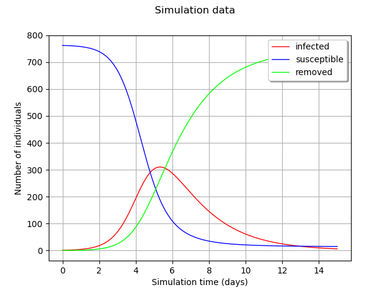

Examples
========

Epidemiologic example
---------------------

These examples rely on *epid.fmu*. This epidemiologic model represents the spreading of an epidemic through a population.

.. toctree::
   :maxdepth: 1

   ../auto_example/epid/index.rst

Common low-level functions
--------------------------

The 4 classes mentioned here upper are based on low-level functions
from the submodule ``otfmi.fmi``.

These functions can be used to load, initialize or simulate the FMU
with more control. The tutorials are based on the static
*deviation.fmu* example.

.. toctree::
   :maxdepth: 1

   ../auto_example/low_level/index.rst

From OpenTURNS to FMI
---------------------

.. warning::
   **This feature is experimental.**

The focus of OTFMI module is to enable FMUs analysis using OpenTURNS.
Once a computationnally heavy FMU is metamodeled, the modeler may want to employ
the metamodel *instead of the FMU* in the simulation tool.

.. toctree::
   :maxdepth: 1

   ../auto_example/ot_to_fmu/index.rst

Cantilever beam example
-----------------------

These examples rely on *deviation.fmu*.
This mechanical model represents the deviation of a cantilever beam submitted to a load at its end.
Unlike most FMI models the deviation model is static, i.e. its output does not evolve over time.

.. image:: ../_static/beam.png
   :scale: 25 %
   :alt: alternate text
   :align: center

.. toctree::
   :maxdepth: 1

   ../auto_example/deviation/index.rst
