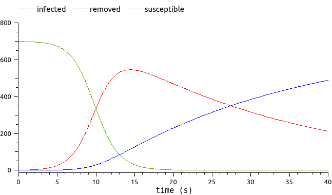

# Examples

The mathematical methods applying to static or dynamic FMUs are pretty different. Hence [Otfmi](../index.md) provides different wrappers for these two kinds of physical models.

> **Note:**
> - A *static* FMU yields one or several time-invariant output(s).
> - A *dynamic* FMU yields one or several output(s) that evolve over time; the FMU simulation time is important to set.

## Explore Static FMUs

All static examples rely on *deviation.fmu*. This mechanical model represents the deviation of a cantilever beam submitted to a load at its end.

- [Static FMU Examples](static/index.md)

## Explore Dynamic FMUs

All dynamic examples rely on *epid.fmu*. This epidemiologic model represents the spreading of an epidemic through a population.

- [Dynamic FMU Examples](dynamic/index.md)

## Common Low-Level Functions

The four classes mentioned above are based on low-level functions from the submodule `otfmi.fmi`. These functions can be used to load, initialize, or simulate the FMU with more control. The tutorials are based on the static *deviation.fmu* example.

- [Low-Level Functions](low_level/index.md)

## From OpenTURNS to FMI

> **Warning:**
> **This feature is experimental.**

The focus of the OTFMI module is to enable FMUs analysis using OpenTURNS. Once a computationally heavy FMU is metamodeled, the modeler may want to employ the metamodel *instead of the FMU* in the simulation tool.

- [OpenTURNS to FMI](ot_to_fmu/index.md)
